# PulseRTC - Full-Stack WebRTC Video & Audio Calling Application

A modern, high-performance, real-time peer-to-peer (P2P) video and audio calling application built with **React 19**, **Vite**, **Tailwind CSS**, the **WebRTC API**, and **Node.js / Socket.IO** signaling. Fully responsive across desktop, tablet, and mobile devices.

---

## Table of Contents
- [Architecture & How WebRTC Works](#-architecture--how-webrtc-works)
- [Key Features](#-key-features)
- [Mobile-Responsive Design & View Modes](#-mobile-responsive-design--view-modes)
- [Audio & Video Facilities](#-audio--video-facilities)
- [Project Architecture & Components](#-project-architecture--components)
- [Setup & Installation Guide](#-setup--installation-guide)
- [How to Test Locally (2 Users)](#-how-to-test-locally-2-users)
- [Troubleshooting & Common Pitfalls](#-troubleshooting--common-pitfalls)

---

## Architecture & How WebRTC Works

WebRTC (Web Real-Time Communication) enables direct peer-to-peer transfer of encrypted audio and video between browsers with sub-second latency. 

However, two browsers cannot communicate directly until they discover each other's network addresses and capabilities. A lightweight **Signaling Server** (using Socket.IO in Node.js) acts as the mediator to exchange Session Description Protocol (SDP) metadata and ICE connection details.

### WebRTC Connection Sequence

```mermaid
sequenceDiagram
    autonumber
    actor PeerA as Peer A (Caller)
    participant Server as Socket.IO Signaling Server
    actor PeerB as Peer B (Callee)

    Note over PeerA,PeerB: 1. Room Joining & Discovery
    PeerA->>Server: room:join { email, roomId }
    PeerB->>Server: room:join { email, roomId }
    Server-->>PeerA: user:joined { email, id: PeerB }

    Note over PeerA,PeerB: 2. Upfront Track Attachment & Offer Generation
    PeerA->>PeerA: getUserMedia() + peer.addTrack(video, audio)
    PeerA->>PeerA: peer.createOffer() + waitForIceGathering()
    PeerA->>Server: user:call { to: PeerB, offer }
    Server-->>PeerB: incomming:call { from: PeerA, offer }

    Note over PeerA,PeerB: 3. Callee Answer & Immediate Media Flow
    PeerB->>PeerB: getUserMedia() + peer.addTrack(video, audio)
    PeerB->>PeerB: peer.setRemoteDescription(offer)
    PeerB->>PeerB: peer.createAnswer() + waitForIceGathering()
    PeerB->>Server: call:accepted { to: PeerA, ans }
    Server-->>PeerA: call:accepted { ans }

    PeerA->>PeerA: peer.setRemoteDescription(ans)

    Note over PeerA,PeerB: 4. Direct P2P Media Stream (Encrypted SRTP)
    rect rgb(20, 30, 45)
    PeerA<<-->>PeerB: Direct Bidirectional Video & Audio
    end
```



---

## Key Features

- **100% Mobile Responsive**: Seamlessly adapts from 360px smartphone viewports up to 4K desktop screens.
- **Flexible View Modes**:
  - **Grid Mode**: Balanced side-by-side (desktop) or stacked (mobile) view.
  - **Picture-in-Picture (PiP) Mode**: Focus on the remote participant while keeping your local preview floating in the corner.
- **Crystal Clear Audio**: Enabled with hardware echo cancellation, noise suppression, and auto gain control via `navigator.mediaDevices.getUserMedia`.
- **Live Speaking Indicator**: Web Audio API (`AudioContext` + `AnalyserNode`) visualizer highlighting active speakers with an animated green halo.
- **Touch-Friendly Floating Controls**:
  - Instant microphone Mute / Unmute.
  - Webcam camera On / Off with placeholder fallback.
  - Stream sync / track replacement without call disruption.
  - Prominent End Call button with safe navigation.
- **One-Click Room Sharing**: Copy Room ID with animated feedback toast.
- **Interactive Incoming Call Dialog**: Drop-in notification modal with Accept and Decline actions.

---

## Mobile-Responsive Design & View Modes

PulseRTC is engineered specifically for mobile browsers (iOS Safari, Chrome for Android, Brave):
1. **Dynamic Viewport Units**: Uses `100dvh` (Dynamic Viewport Height) so the bottom address bar on mobile devices never cuts off the call controls.
2. **Safe Area Inset Support**: Includes `pb-safe` to prevent UI overlap with iPhone home indicators and Android gesture bars.
3. **Picture-in-Picture (PiP) Toggle**: On mobile, toggle between the stacked grid and a corner floating preview. Tap the floating preview to swap screens.
4. **Touch Target Accessibility**: All buttons are sized to at least 44px–48px with haptic-like active scale animations.

---

## Audio & Video Facilities

### 1. Microphone Mute / Unmute
Instead of destroying and requesting a new media stream (which triggers browser permission prompts and lag), tracks are enabled or disabled on the hardware layer:
```javascript
const toggleAudio = () => {
    const audioTracks = myStreamRef.current.getAudioTracks();
    audioTracks.forEach((track) => {
        track.enabled = !isAudioMuted;
    });
};
```

### 2. Audio Feedback & Echo Prevention (Crucial WebRTC Rule)
- **Local `<video>` Element**: Must ALWAYS have `muted={true}`. Otherwise, your microphone input plays through your own speakers, creating feedback loop screeching.
- **Remote `<video>` Element**: Must have `muted={false}` and `autoPlay` so you can hear the remote peer.

### 3. Upfront Track Attachment & Glare Prevention
Tracks are attached to the `RTCPeerConnection` **before** creating the initial offer and answer. This guarantees both video and audio stream on the initial connection without triggering simultaneous `negotiationneeded` collisions (glare).

---

## Project Architecture & Components

```text
webrtc-fullstack/
├── webrtc-backend/                 # Node.js Signaling Server
│   ├── index.js                    # Socket.IO room & offer/answer routing
│   └── package.json
│
└── webrtc-ui/                      # React 19 Frontend
    ├── src/
    │   ├── components/             # Modular, reusable UI components
    │   │   ├── RoomHeader.jsx      # Responsive navigation, status pill & PiP toggle
    │   │   ├── VideoCard.jsx       # Video display, speaking halo, fallback states
    │   │   ├── CallControls.jsx    # Touch-friendly floating bottom dock
    │   │   └── IncomingCallModal.jsx # Drop-in incoming call alert
    │   ├── context/
    │   │   └── SocketProvider.jsx  # Global Socket.IO context
    │   ├── services/
    │   │   └── peer.js             # WebRTC PeerService with Vanilla ICE gathering
    │   ├── App.jsx                 # Route definitions
    │   ├── main.jsx                # Application root
    │   └── index.css               # Dark theme, glows, and safe-area utilities
    ├── screens/
    │   ├── LobbyPage.jsx               # Responsive landing page with random room generator
    │   └── RoomPage.jsx            # Main calling room orchestrator
    └── package.json
```

---

## Setup & Installation Guide

### Prerequisites
- [Node.js](https://nodejs.org/) (v18 or higher recommended)
- A working webcam and microphone

---

### Step 1: Start the Backend Signaling Server

1. Open your terminal:
   ```bash
   cd webrtc-backend
   ```
2. Install dependencies:
   ```bash
   npm install
   ```
3. Start the server:
   ```bash
   npm run dev
   # Or: node index.js
   ```
   *The server will run on port `8000`.*

---

### Step 2: Start the Frontend UI

1. Open a second terminal window:
   ```bash
   cd webrtc-ui
   ```
2. Install dependencies:
   ```bash
   npm install
   ```
3. Start the Vite dev server:
   ```bash
   npm run dev
   ```
4. Open the displayed URL in your browser (typically `http://localhost:5173`).

---

## 👥 How to Test Locally (2 Users)

To test a video and audio call between two peers on the same computer:

1. **Tab 1 (User A)**:
   - Open `http://localhost:5173`.
   - Enter an email (e.g. `user1@example.com`).
   - Enter Room ID (e.g. `TEST-100`) or click **Random ID**.
   - Click **Enter Meeting Room**.
2. **Tab 2 (User B)**:
   - Open a second window (Incognito / Private mode or another browser).
   - Navigate to `http://localhost:5173`.
   - Enter a second email (e.g. `user2@example.com`).
   - Enter the **same Room ID** (`TEST-100`).
   - Click **Enter Meeting Room**.
3. In Tab 1, you will see the status change to **"Peer Ready"** with a green **"Start Call Now"** button.
4. Click **Start Call Now**:
   - Allow camera and microphone permissions when prompted.
   - Tab 2 will receive an animated **Incoming Video Call** prompt.
   - Click **Accept**.
5. Both video and audio streams will immediately stream peer-to-peer!
6. Click the **PiP** button in the header or resize your window to test mobile responsive layouts.

---

## ❓ Troubleshooting & Common Pitfalls

| Issue | Cause | Solution |
| :--- | :--- | :--- |
| **Remote video is black / not showing** | Tracks were not added before offer/answer, or ICE was incomplete | Solved in `RoomPage.jsx` & `peer.js` by adding tracks upfront and waiting for ICE gathering. |
| **Cannot hear remote peer** | Remote `<video>` element was muted | Remote video must have `muted={false}`. Local video must have `muted={true}`. |
| **Permission Denied (Camera/Mic)** | Browser blocked media devices | Click the lock/camera icon in your browser address bar and set permissions to **Allow**. |
| **CORS Error** | Backend Socket server rejected origin | Verify `cors: true` in `webrtc-backend/index.js`. |
| **Controls cut off on mobile Safari** | Fixed 100vh doesn't account for mobile URL bars | Use `h-[100dvh]` and `pb-safe` (configured in `index.css`). |
