# PulseRTC - Production-Grade WebRTC Video & Audio Calling Application

A modern, high-performance, real-time peer-to-peer (P2P) video and audio calling platform engineered with **React 19**, **Vite**, **Tailwind CSS**, the **WebRTC API**, and **Node.js / Socket.IO** signaling. Features full STUN/TURN NAT traversal, carrier-grade network compatibility, adaptive Picture-in-Picture (PiP), and Web Audio API live speaker detection.

---

## 📑 Table of Contents
1. [System Architecture & Core Concepts](#-system-architecture--core-concepts)
2. [Signaling Plane vs. Media Plane](#-signaling-plane-vs-media-plane)
3. [End-to-End Call Sequence Flow](#-end-to-end-call-sequence-flow)
4. [NAT Traversal: Host, STUN, and TURN Explained](#-nat-traversal-host-stun-and-turn-explained)
5. [Key Engineering Challenges & Solutions](#-key-engineering-challenges--solutions)
6. [Component & Directory Structure](#-component--directory-structure)
7. [Environment Variables & Configuration](#-environment-variables--configuration)
8. [Local Development & Setup Guide](#-local-development--setup-guide)
9. [Deployment (Vercel + Render)](#-deployment-vercel--render)
10. [Troubleshooting & Gotchas](#-troubleshooting--gotchas)

---

## 🏛 System Architecture & Core Concepts

PulseRTC is partitioned into two distinct communication channels:

```text
┌────────────────────────────────────────────────────────────────────────┐
│                        PULSERTC ARCHITECTURE                           │
└────────────────────────────────────────────────────────────────────────┘

 [ Client A (Browser) ]                          [ Client B (Browser) ]
       │                                                   │
       │           1. Signaling Plane (WebSocket)          │
       ├─────────────────► [ Socket.IO Server ] ◄──────────┤
       │                   (Node.js / Render)              │
       │                   - Room Discovery                │
       │                   - SDP Offer / Answer            │
       │                   - Renegotiation Signals         │
       │                                                   │
       │           2. NAT Discovery & Traversal            │
       ├─────────────────► [ STUN Servers ] ◄──────────────┤
       │                   (Google / Cloudflare / Twilio)  │
       │                   - Discovers Public IP:Port      │
       │                                                   │
       │           3. Media Relay Fallback (If CGNAT)      │
       ├─────────────────► [ TURN Servers ] ◄──────────────┤
       │                   (Metered OpenRelay)             │
       │                   - Relays Encrypted Media        │
       │                                                   │
       │           4. Media Plane (SRTP / DTLS)            │
       ▼===================================================▼
       [ Direct Encrypted Audio & Video Peer-to-Peer Stream ]
```

---

## ⚡ Signaling Plane vs. Media Plane

| Dimension | Signaling Plane (Socket.IO) | Media Plane (WebRTC) |
| :--- | :--- | :--- |
| **Protocol** | WebSocket (`wss://`) / HTTP Polling | SRTP (Secure Real-Time Transport Protocol) over UDP |
| **Role** | Discovery, Room routing, SDP exchange | Live Microphone & Camera streams |
| **Latency** | 50ms – 250ms (Signaling handshake) | Sub-150ms ultra-low latency real-time media |
| **Server Bandwidth** | Negligible (JSON metadata only) | High bandwidth (P2P direct, zero load on backend) |
| **Security** | TLS encrypted WebSocket (`https`) | End-to-end encrypted (DTLS-SRTP) |

---

## 🔄 End-to-End Call Sequence Flow

The following sequence illustrates the full lifecycle of a video call: Room join, deterministically ordered track attachments, Vanilla ICE gathering, and P2P media flow:

```mermaid
sequenceDiagram
    autonumber
    actor PeerA as Peer A (Caller)
    participant Server as Socket.IO Signaling Server
    actor PeerB as Peer B (Callee)
    participant STUN as STUN / TURN Relays

    Note over PeerA,PeerB: Phase 1: Room Discovery
    PeerA->>Server: room:join { email: "a@test.com", roomId: "101" }
    PeerB->>Server: room:join { email: "b@test.com", roomId: "101" }
    Server-->>PeerA: user:joined { email: "b@test.com", id: PeerB_SocketId }

    Note over PeerA,PeerB: Phase 2: Media Capture & Deterministic Track Attachment
    PeerA->>PeerA: getUserMedia({ audio: true, video: true })
    PeerA->>PeerA: addTrack(audioTrack) -> [m=audio (index 0)]
    PeerA->>PeerA: addTrack(videoTrack) -> [m=video (index 1)]
    PeerA->>STUN: Query STUN for public Reflexive (srflx) candidate
    PeerA->>PeerA: createOffer() + waitForIceGathering(4000ms)
    PeerA->>Server: user:call { to: PeerB, offer }
    Server-->>PeerB: incomming:call { from: PeerA, offer }

    Note over PeerA,PeerB: Phase 3: Callee Remote Alignment & Answer
    PeerB->>PeerB: setRemoteDescription(offer) [Locks m-lines: 0: audio, 1: video]
    PeerB->>PeerB: getUserMedia({ audio: true, video: true })
    PeerB->>PeerB: addTrack(audioTrack) -> attaches to m=audio
    PeerB->>PeerB: addTrack(videoTrack) -> attaches to m=video
    PeerB->>STUN: Query STUN for public Reflexive (srflx) candidate
    PeerB->>PeerB: createAnswer() + waitForIceGathering(4000ms)
    PeerB->>Server: call:accepted { to: PeerA, ans }
    Server-->>PeerA: call:accepted { ans }
    PeerA->>PeerA: setRemoteDescription(ans)

    Note over PeerA,PeerB: Phase 4: Direct P2P Media Flow (or TURN Relay)
    rect rgb(15, 23, 42)
    PeerA<<-->>PeerB: Direct Bidirectional Encrypted Video & Audio (SRTP)
    end
```



---

## 🌐 NAT Traversal: Host, STUN, and TURN Explained

When two devices want to talk, their network relationship dictates which ICE candidates succeed:

```text
1. HOST CANDIDATE (Same Local Network / LAN)
   Peer A [192.168.1.10] ───────────────► Peer B [192.168.1.15]
   ✅ Works directly over the local Wi-Fi router without public internet.

2. STUN CANDIDATE (Different Cities, Cone NAT)
   Peer A ───► [STUN Server] ───► Discovers Public IP:Port [103.21.x.x:45231]
   Peer A [103.21.x.x:45231] ◄──────────► Peer B [49.36.x.x:51240]
   ✅ Direct P2P hole-punching succeeds across the open internet.

3. TURN CANDIDATE (Mobile Data / Symmetric NAT / CGNAT / Strict Firewalls)
   Peer A [Behind 4G CGNAT]                Peer B [Behind 5G CGNAT]
         │                                       │
         └────────► [ TURN RELAY SERVER ] ◄──────┘
                    (Metered OpenRelay)
   ✅ Packets are relayed securely through TURN on ports 80/443 when direct P2P is blocked.
```

* **Why local calls worked without TURN**: On the same Wi-Fi router, both devices use `typ host` candidates (`192.168.x.x`). They connect directly without touching external IP routing.
* **Why cross-city / mobile calls need TURN**: Mobile networks (Jio, Airtel, Vi) utilize **Carrier-Grade NAT (CGNAT)** where ports are dynamically randomized per connection. Direct STUN hole punching is mathematically impossible, making a TURN relay mandatory.

---

## 🛠 Key Engineering Challenges & Solutions

### 1. SDP M-Lines Order Mismatch (`InvalidAccessError`)
* **Problem**: In WebRTC RFC 3264, once the initial offer sets the media section order (e.g. `m=audio` at index 0, `m=video` at index 1), all subsequent offers must strictly preserve that order. In earlier code, `acceptIncomingCall` was adding local tracks *before* applying `setRemoteDescription(offer)`. Because `stream.getTracks()` returns tracks in arbitrary order (often video first), transceivers were allocated in the reverse order, causing browser renegotiation to crash with `InvalidAccessError`.
* **Solution**:
  1. We enforce deterministic track attachment: `audioTrack` first, `videoTrack` second via `addTracksToPeer()`.
  2. The answering peer applies `await peer.setRemoteDescription(offer)` **before** adding local tracks. This aligns the transceivers to the caller's SDP layout.
  3. Added `isCallSetupInProgress` guard flag to ignore spurious `negotiationneeded` events while initial handshake is in progress.

### 2. Video Playback Interruption (`AbortError`) & Black Screen
* **Problem**: An inline ref callback and `useEffect` with `[stream, label]` in `VideoCard.jsx` repeatedly reassigned `videoRef.current.srcObject = stream` every time the audio visualizer or room state updated, triggering `AbortError: The play() request was interrupted by a new load request`. Furthermore, when the remote peer's video track arrived after the audio track on the same `MediaStream` instance, React didn't detect a reference change, leaving the video element black.
* **Solution**:
  1. Replaced the inline ref with a stable `ref={videoRef}` and protected `srcObject` assignment (`if (videoEl.srcObject !== stream)`).
  2. Wrapped incoming tracks in a fresh `new MediaStream(stream.getTracks())` and subscribed to `stream.onaddtrack` to force React to bind both audio and video tracks immediately.

### 3. Premature ICE Gathering Timeout (1.2s vs. Real-World STUN)
* **Problem**: Vanilla ICE used a `1200ms` hard timeout. Querying STUN servers across international routing takes 2.0 to 3.5 seconds. The 1.2s timer aborted gathering early, emitting an SDP containing *only* private LAN IPs (`192.168.x.x`), leaving cross-city calls stuck in `checking`.
* **Solution**: Extended gathering timeout to `4000ms`, added multiple global STUN servers (Google, Cloudflare, Twilio, Metered), and added full TURN relay configuration support.

---

## 📂 Component & Directory Structure

```text
webrtc-fullstack/
├── webrtc-backend/                         # Signaling Server (Node.js)
│   ├── index.js                            # Socket.IO room management & signal routing
│   └── package.json
│
└── webrtc-ui/                              # Frontend Client (React 19 + Vite)
    ├── public/
    ├── screens/
    │   ├── LobbyPage.jsx                   # Room code input & random room ID generator
    │   └── RoomPage.jsx                    # Core WebRTC orchestrator, state & media hooks
    ├── src/
    │   ├── components/
    │   │   ├── RoomHeader.jsx              # Status pill, room ID badge & PiP toggle
    │   │   ├── VideoCard.jsx               # Video display, speaking halo, camera-off fallback
    │   │   ├── CallControls.jsx            # Floating dock: Mute, Camera, Sync, Leave
    │   │   └── IncomingCallModal.jsx       # Drop-in incoming call modal (Accept / Decline)
    │   ├── context/
    │   │   └── SocketProvider.jsx          # Context provider with single memoized Socket.IO client
    │   ├── services/
    │   │   └── peer.js                     # PeerService singleton with ICE gathering & TURN config
    │   ├── App.jsx                         # React Router routes (/ and /room/:roomId)
    │   ├── main.jsx                        # React root entry
    │   └── index.css                       # Dark theme, glassmorphism, responsive safe-area rules
    ├── .env.example                        # Template for backend and TURN credentials
    ├── vercel.json                         # SPA client-side route rewrites
    ├── vite.config.js
    └── package.json
```

---

## ⚙️ Environment Variables & Configuration

Create a `.env` file inside the `webrtc-ui/` directory:

```env
# URL of your Socket.IO Signaling Server
VITE_BACKEND_URL=https://pulsertc-signaling-backend.onrender.com

# Optional: TURN Server Credentials (Required for Cross-City / 4G / 5G Calls)
# Free 20GB/month credentials available at https://www.metered.ca/tools/openrelay/
VITE_TURN_URL=turn:global.relay.metered.ca:80,turn:global.relay.metered.ca:80?transport=tcp,turn:global.relay.metered.ca:443,turns:global.relay.metered.ca:443?transport=tcp
VITE_TURN_USERNAME=your_metered_username
VITE_TURN_PASSWORD=your_metered_credential
```

*Note: If `VITE_TURN_*` variables are omitted or commented out, the application functions normally on local networks and open NATs using the built-in STUN servers.*

---

## 🚀 Local Development & Setup Guide

### 1. Clone the repository
```bash
git clone https://github.com/krishnaa6268/pulsertc-vcall-app-ui.git
cd webrtc-fullstack
```

### 2. Start the Backend Signaling Server
```bash
cd webrtc-backend
npm install
npm run dev
# Server listens on http://localhost:8000
```

### 3. Start the Frontend UI
```bash
cd ../webrtc-ui
npm install
npm run dev
# Frontend runs on http://localhost:5173
```

### 4. How to Test Between 2 Peers Locally
1. Open `http://localhost:5173` in your primary browser window.
2. Enter your email (e.g. `alice@gmail.com`) and click **Random ID** (e.g. `ROOM-777`). Click **Enter Meeting Room**.
3. Open an Incognito / Private window or another browser, navigate to `http://localhost:5173`, enter `bob@gmail.com`, enter the same room code (`ROOM-777`), and join.
4. In Alice's window, click **Start Call Now**. Allow camera and microphone permissions.
5. In Bob's window, an animated incoming call modal will appear. Click **Accept**.
6. Both video and audio streams will immediately stream peer-to-peer!

---

## 🌐 Deployment (Vercel + Render)

### Backend (Render / Railway / VPS)
1. Deploy `webrtc-backend` as a Node Web Service.
2. Ensure CORS in `webrtc-backend/index.js` includes your frontend domain:
   ```javascript
   cors: {
     origin: [
       "http://localhost:5173",
       "https://pulsertc-vcall-app-ui.vercel.app" // No trailing slash!
     ],
     methods: ["GET", "POST"]
   }
   ```

### Frontend (Vercel)
1. Deploy `webrtc-ui` as a Vite application.
2. Under **Project Settings → Environment Variables**, add:
   * `VITE_BACKEND_URL`: Your Render backend URL.
   * `VITE_TURN_URL`, `VITE_TURN_USERNAME`, `VITE_TURN_PASSWORD`: Your TURN credentials.
3. Redeploy the application.

---

## ❓ Troubleshooting & Gotchas

| Symptom | Cause | Solution |
| :--- | :--- | :--- |
| **Call connects on Wi-Fi, fails on 4G/different city** | Symmetric NAT / CGNAT blocks direct P2P | Configure Metered OpenRelay TURN credentials in `.env` / Vercel. |
| **SDP M-Lines order mismatch error** | Tracks added before `setRemoteDescription` | Solved: Remote description is applied first, then local tracks attached in audio-then-video order. |
| **Remote video black / paused** | Multiple re-renders interrupted `.play()` | Solved: Protected `videoRef` assignment and auto-play on `onLoadedMetadata`. |
| **Echo / Feedback howling** | Local video element was unmuted | Local `<video>` must always have `muted={true}`. Remote video must have `muted={false}`. |
| **Socket connection refused** | Backend is asleep (Render free tier) | Visit the backend URL in your browser once to wake up the Render instance. |


What is WebRTC?-

WebRTC is an open-source project that enables real-time audio, video, and data transfer between browsers and devices without requiring plugins or external software. It supports peer-to-peer (P2P) connections, allowing developers to create applications for voice calls, video chats, and real-time data sharing directly in web browsers or mobile apps.

How Does WebRTC Work?

WebRTC works by enabling direct peer-to-peer communication between browsers or devices without the need for external plugins or software. It facilitates real-time audio, video, and data exchange over the Internet using several key components:

1. Signaling-

WebRTC begins with a signaling process that establishes the connection between peers. While WebRTC does not mandate a specific signaling protocol, common methods like WebSockets or server-based protocols facilitate the exchange of metadata, including network details, codecs, and session information. This process enables peers to negotiate and agree on communication parameters.

2. NAT Traversal-

To establish a direct connection between peers, even when they’re behind firewalls or NATs (Network Address Translators), WebRTC uses ICE (Interactive Connectivity Establishment). ICE identifies the best path for communication using STUN (Session Traversal Utilities for NAT) and TURN (Traversal Using Relays around NAT) servers to negotiate the connection.

3. Media and Data Channels-

Once signaling is complete and the connection is established, WebRTC facilitates real-time exchange of audio, video, and data through two primary channels:

RTP (Real-time Transport Protocol) for media (audio and video) streams.
SCTP (Stream Control Transmission Protocol) for real-time data transfer.
By bypassing the need for intermediaries, WebRTC enables low-latency, high-quality communications for applications like video conferencing, live streaming, and peer-to-peer file sharing directly in web browsers.
